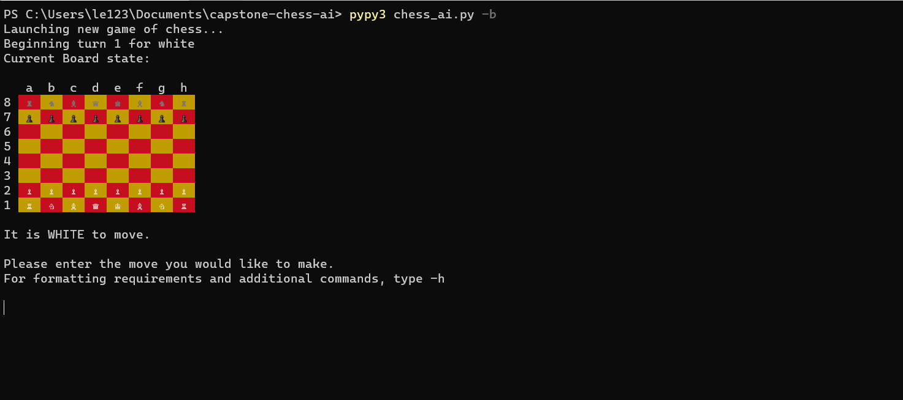
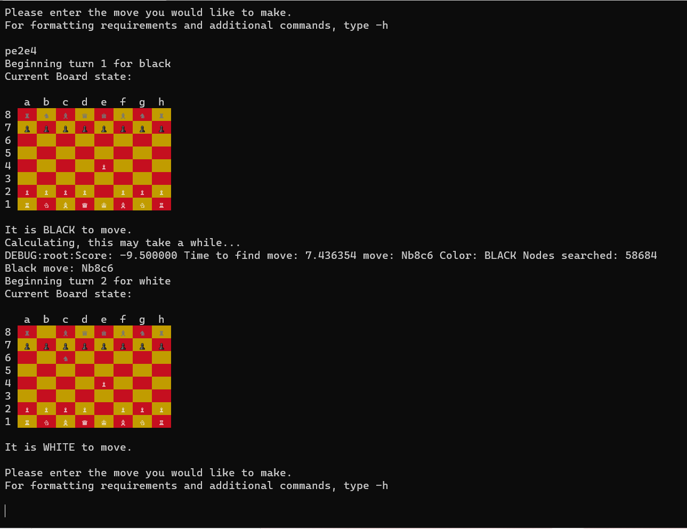

# Capstone-chess-ai
## Introduction
This is a chess game with functionality for playing with any combination of human and/or AI players for white or black.

All components were built using python3. Some external libraries were used for UI purposes, but all critical components were built by hand.
##Table of Contents:
* Requirements
* Installation
* Quickstart
* Project Structure
* Algorithm
## Requirements
* Python3.9
* [pip](https://pypi.org/project/pip/) (Should normally be installed with pyython)
* [pypy](https://www.pypy.org/) (Optional, but HIGHLY recommended to reduce computation time) 

## Installation 
Before the project can be launched, external libraries must first be installed. This can be done by navigating to the directory from the terminal, and running
```pip install -r requirements.txt```

If using [pypy](https://www.pypy.org/) (see below), some additional assembly is required. First, extract the pypy zip file (with all components) to a new directory.
 
Once that is done, run the following commands:
```path\to\pypy.exe -m ensure pip
path\to\pypy.exe -m pip install colorama
```

(OPTIONAL) The program attempts to use unicode characters to represent chess pieces, but this does not work out of the box. While not required for the program to run, using unicode can improve the visual experience of playing the game. If ASCII characters are acceptable, feel free to skip this step.

First, a unicode-compatible command line terminal must be installed. On windows, this can be done through [Windows Terminal](https://www.microsoft.com/en-us/p/windows-terminal/9n0dx20hk701?activetab=pivot:overviewtab). Please note that neither Windows Powershell nor the default command line application support unicode at this time.

Additionally, to enable unicode, language settings must be changed. Follow the instructions [here](https://www.java.com/en/download/help/locale.html) to do so.

Unicode is not required for the program to work. If you would prefer to have pieces represented by ASCII characters, or you are experiencing issues in displaying unicode characters, run the program with the --no-unicode parameter, like so:
```path\to\pypy.exe chess_ai.py -b --no-unicode``` or ```python chess_ai.py -b --no-unicode```

### Quickstart
If you just want to play against the AI and aren't interested in the additional options, run
```
pypy3 chess_ai.py -b --no-unicode
```


This will put you in a game against the 'best' AI available. The AI plays as black; to switch sides and have the AI play as white, replace '-b' with '-w'. 

**It is _strongly_ recommended that you use [pypy](https://www.pypy.org/) to run the AI as using the default python interpreter will dramatically increase computation time.**

To watch a game played between two AI's, run ```pypy3 chess_ai.py -b -w```

When first booting up the game, the command line will display a board like the following:



White pieces are displayed by a capital letter, while black is displayed in lowercase. To avoid duplicating the K for King, knights are represented with an N.
To make a move on the board, type the character of the piece to move followed by its original rank/file then its new rank/file.
For example, to move a pawn to e4, run
```
pe2e4
``` 
The board will then look like this:


To make determining the input for a move easier, one can run ```-m``` in the command line for a list of all properly formatted valid moves.

If a mistake is made during play, enter ```-u``` or ```--undo``` into the terminal to undo the previous two moves. Additonally, ```-e``` or ```--exit``` will exit the program, and ```-p``` will list all pieces available to both sides.


## Project structure:
Currently, the list of AI agents to chose from includes:
* RandomAgent: picks a random legal move. Intended as a baseline, obviously pretty easy to beat.
* FixedRandomAgent: same as RandomAgent except the seed for random.choice() is fixed constant, so FixedRandomAgent will always make the same move in a given board state. Used to compare the decision making of different AIs in a controlled environment.
* PieceValueAgent: chooses the move that will result in the maximum utility based on the value of each piece on the board. This agent picks the move that will maximize its own piece values while minimizing that of the opponent (though if it has the opportunity to checkmate, it'll just do that instead). While this AI doesn't make mistakes and is good at short term tactics, it fails to make strategic moves that put it in a good long-term position (for instance, it places no value on castling/protecting its king, and advances pawns in an arbitrary fashion as opposed to attempting to control the center) and can be outsmarted through positional play.
* LocationAgent: The 'best' agent, and likely the one you want to use. Works like PieceValueAgent, except it also weighs the position of pieces on the board in its utility calculation. This AI will attempt to develop its pieces in good positions and force its opponent to move pieces out of position, making it much stronger than the PieceValueAgent and extremely difficult to beat. 
* MichniewskiAgent: an alternative location agent; largely unused and redundant. See 'alternatives' under 'utility_writeup.md' for more details.
###Packages:
* `chess_lib` -- contains classes and methods related to the rules of chess.
    * `chess_piece` -- abstract data structure used to represent a piece, with subclasses for each piece type, and methods for move generation.
    * `game_board` -- the container used to represent a chess board, with several helper functions for UI
    * `move` -- represents a move on the board, with subclasses for special cases (Castling, pawn promotion)
    * `chess_utils` -- various helper functions and enums related to the mechanics of chess that don't fit in any of the other files. 
* `game` -- contains wrapper for the player to view/interact with the actual chess game.
* `ai` -- contains everything related to the chess AI
    * `agent` -- an abstract superclass for AIs written for this game. Also contains RandomAgent and FixedRandomAgent.
    * `minimax_agent` -- contains AbstractMinimaxAgent, an abstract subclass of Agent with the minimax algorithm implemented, but the evaluation function left for subclassing. Also contains PieceLocationAgent and PieceValueAgent
    * `heuristics` -- contains all functions and constants used in utility calculation by the subclasses of AbstractMinimaxAgent
* `test` -- contains a wide range of unit tests and input files used for said tests. 
* `chess_ai.py` -- the main script that launches the rest of the program.

## Algorithm


The AI algorithm used for this project (other than RandomAgent and FixedRandomAgent) is the [minimax algorithm](https://en.wikipedia.org/wiki/Minimax). A picture is attached above to illustrate the process. In the context of AI theory, minimax is an algorithm for zero-sum, turn based games. Minimax generates a decision tree for every possible combination of moves from the current state, and chooses the move that 'maximizes' the AI's utility in a worst-case scenario. 

To accomplish this, the AI performs a depth-first search on the tree. At each leaf node, it calculates the 'utility' of the game state after the moves corresponding to the node have been played. Once all child nodes of a node have been processed, the AI sets the node utility value to the maximum utility of its children (if the node corresponds to its own turn) or the minimum (if the node corresponds to the opponent's turn). In this way, the AI picks the move that will minimize its opponents gains in a worst case scenario, while also maximizing its own--hence the name 'minimax'. 

Utility is the measure of how beneficial a given state is for the AI. The manner in which utility is calculated varies depending on the game played. For details on how utility is caclulated, see utility_writeup.md
 